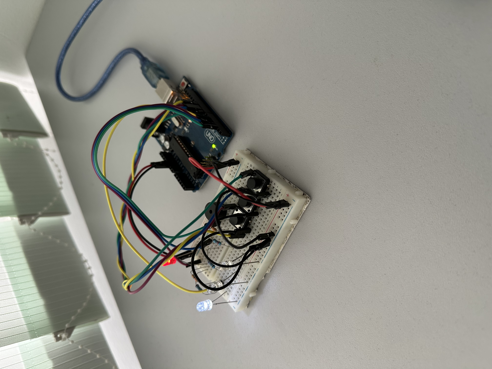
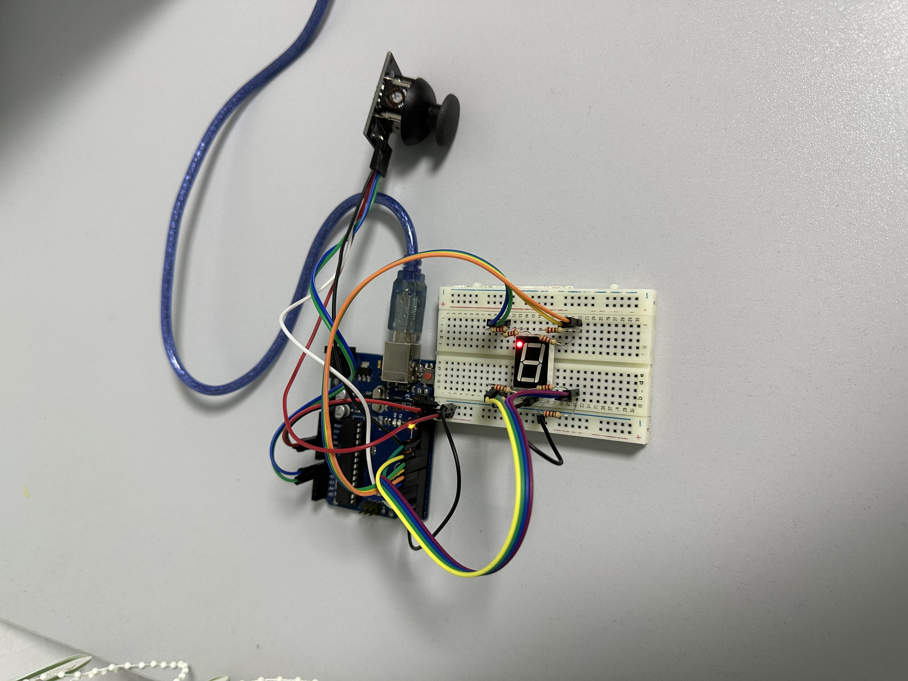
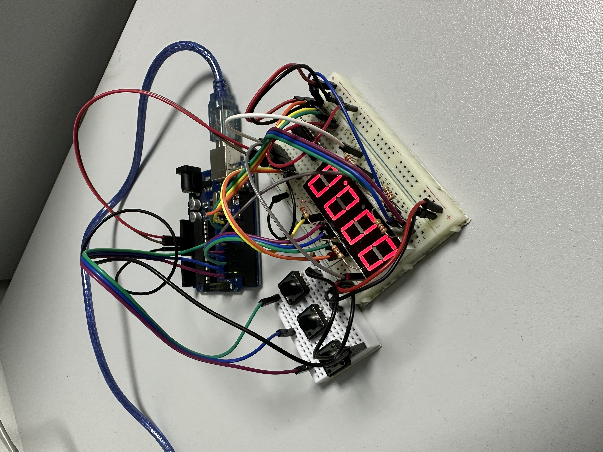
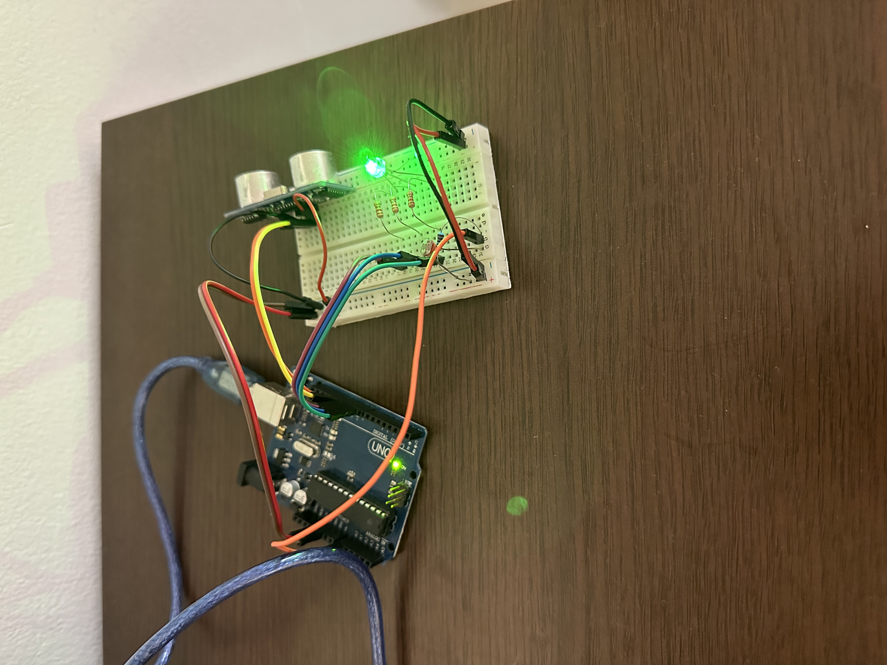

# Introduction to Robotics (2023 - 2024)

_Introduction to Robotics laboratory assignments completed during the third year at the Faculty of Mathematics and Computer Science, University of Bucharest. Each assignment entails specific instructions, implementation particulars, as well as code and image files._

## Homework #1 - RGB LED

This assignment focuses on controlling each channel (Red, Green, and Blue) of  an  RGB  LED  using  individual  potentiometers.
Three Potentiometers, one RGB LED and coresponding wires and resistors were used to build this project. Capacitors were also used to _filter_ the noisy input of the potentiometers. The potentiometers’s analog values are read with an Arduino UNO and then the mamapped values are written to the LED pins.

Video: https://youtu.be/MSEW_lssp1M?si=4kzzFp8WuwO-5N67

  

## Homework #2 - Elevator Simulator

The scope of this project is to simulate a three floor elevator control system.
Each floor is represented by one LED, the current floor LED lights up to represent
the elevator moving through the floors. An additional LED is used to indicate the elevator
status. This LED remains static while the elevator si stationary and blinks while the elevator 
is moving. 
Three buttons are used to call the elevator. The movement to each floor is simulated through cycling 
through the coresponding floors LEDs
A buzzer is used to play sounds such as: the elevator doors closing, the elevator moving and the "cling"
sound an elevator makes when it reaches the desired floor.
If the elevator is already at the selected floor pressing the corresponding button has no effect.
Additionally, when the elevator is traveling, button presses are ignored.
To avoid unintentional button presses we use a debouncing technique.

Video: https://youtu.be/foRM9pGMEos

  

## Homework #3 - 7 Segment Drawing

The scope of this project is to "draw" on a 7 segment display.
The initial position of the drawing cursor is on the decimal point.
We use a joystick to move from one segment to it's neighbours.
The segment that is currently selected blinks regardles of it's state.
Short pressing the joystick toggles the segment ON or OFF and long pressing
the joystick resets all the segments and moves the cursor back to it's starting position,
the decimal point.
Interrupts are used to toggle the segments ON or OFF.
The joystick acts as a toggle to avoid multiple inputs while holding it in one direction.

Video: https://youtu.be/rTrH3HMgBuk

  

## Homework #4 - 7 Stopwatch Timer 

The scope of this project is to build a simple stopwatch with the following functionalities:
  - start/stop the stopwatch
  - reset the stopwatch
  - save up to four lap times
  - view and reset the lap times

A four digit 7 segment display along with a 74HC595N shift register is used to display the timer,
with a tenth of a second precision.
Three buttons are used to control the stopwatch - start/pause, reset, save/cycle lap time.

If the lap button is pressed during the timer counter the lap time is saved. We can only save the last four
lap times, when the limit is reached, we start overwriting the oldest saved lap time.

The reset button only works while the timer is paused.

In pause mode, the lap button cycles through the saved lap times.

Pressing the reset button in lap cycle mode, resets the saved laps.
Pressing the reset button in timer mode (paused) resets the timer.

Interrupts are used on the start/pause and save laps buttons to increase timing precision.

Video: https://youtu.be/jvD5iX-HIFA

  

## Homework #5 - 7 Smart Environment Monitor

This system utilizes various sensors to gather environmental data, log this data into EEPROM,
and provide both visual feedback via an RGB LED and user interaction through a Serial Menu.
The project focuses on integrating sensor readings,memory management,
Serial Communication and the general objective of build-ing a menu.

We use an ultrasonic distance sensor to check if an object is too close and a Light Dependent Resisor
to measure if the light level is too low.

The main interaction method with the smart environment monitor is the Serial menu.

The Menu structure is the following:

Main Menu
1. Sensor Settings
2. Reset Logger Data
3. System Status
4. RGB LED Control

With the following submenu options:

Sensor Settings
1. Sensors Sampling Interval
2. Ultrasonic Alert Threshold
3. LDR Alert Threshold
4. Back

Reset Logger Data
1. Yes
2. No

System Status
1. Current Sensor Readings
2. Current Sensor Settings
3. Display Logged Data
4. Back

RGB LED Control
1. Manual Color Control
2. LED: Toggle Automatic ON/OFF
3. Back

The input from the user is always checked and an error message is shown if the input is invalid
(ex: choosing an option that doesn't exist)

IMPORTANT: We only use EEPROM put and get to avoid excessive wear.

Video: https://youtu.be/I0WkES3a3BE

  

